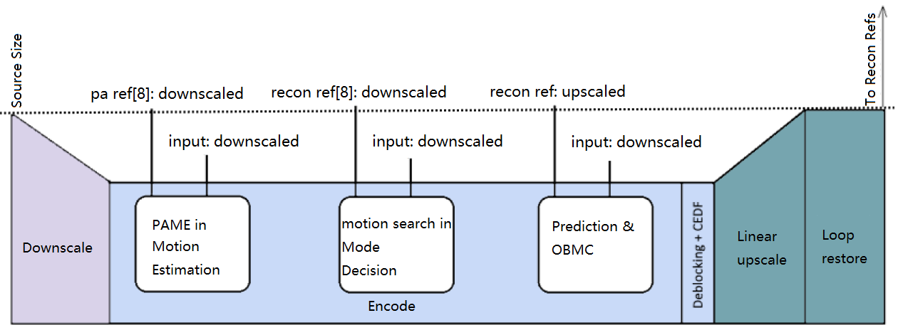
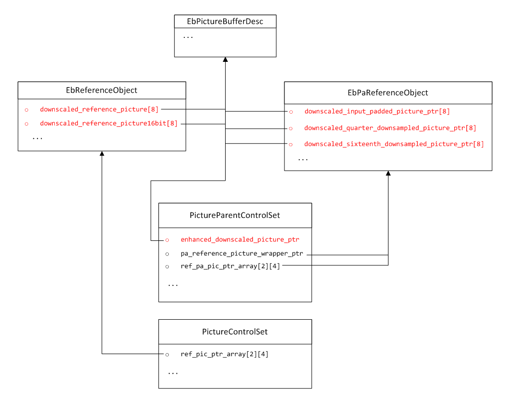

# Super-resolution Appendix

## 1. Description of the algorithm
The AV1 codec allows video to be coded at lower resolution and upscaled to original resolution after reconstructed. This is useful in low bit rate streaming scenario [1]. Figure 1 depicts the architecture of the in-loop filtering pipeline when using super-resolution [2]. At encoder side, the source video is downscaled by a non-normative process first. Second, the downscaled video is encoded, followed by deblocking and CDEF. Third, the video is upscaled to original dimension and applied loop restoration to recover part of high frequency loss. The upscale and loop restoration together is called super-resolve and is normative. At decoder side, the coded video is decoded, and then applied deblocking and CDEF on lower resolution, lastly super-resolved to original video dimension [2]. In order to reduce overheads in line-buffers with respect to hardware implementation, the upscaling and downscaling processes are applied to horizontal dimension only [3]. The downscaling factor is constrained to 8/9 ~ 8/16. The downscale can be applied to some of the frames, especially for those that are too complex to fit in the target bandwidth. The downscaled frames can have different downscaling factors, too. The following sections will cover how the different size pictures work in different coding processes/stages and how the downscaling factor is determined.

##### Figure 1. In-loop filtering pipeline with optional super-resolution

## 2. Implementation of the algorithm
### 2.1. Downscaled and full size versions of pictures
Figure 2 demonstrates how the different size pictures work in different coding processes/stages.

##### Figure 2. Downscaled and full size pictures in coding processes

In Figure 2. Input downscaled denotes the downscaled version of current picture.

In the Motion Estimation process (open-loop stage), pa ref denotes reference list which contains the original input pictures. Downscaled version of references and input picture are used in this process because of pixel-by-pixel SAD.

In the Mode Decision process (in-loop stage), recon ref denotes reference picture list which contains the reconstructed pictures. Downscaled version of references and input picture are used in this process because of pixel-by-pixel SAD.

When doing prediction and OBMC, full size version of reconstructed references and downscaled version of current picture are used to align with the same process in decoder.

After restoration reconstructed version of current picture is updated to recon ref list.

### 2.2. Determination of the downscaling factor
As mentioned, the downscaling factor is constrained to 8/9 ~ 8/16. Since the numerator of factor is fixed to 8, only the denominator needs to be determined. Libaom defines four modes to determine the denominator. They are Fixed, Random, QThreshold and Auto respectively. The mode is set by user. Auto mode has three search types: Auto-Solo, Auto-Dual and Auto-All which is set by Encoder Preset.

Below are how these modes work:
* Fixed: Two denominators can be set by user, one for Key-frames and the other for non-key-frames. Downscale can be applied to all pictures.
* Random: Denominator is set randomly. Downscale can be applied to all pictures. This mode is mainly used for debugging/verification purpose.
* QThreshold: The use of super-resolution will be decided by comparing the QP of the frame with a user-supplied QP threshold.  Downscale is applied to Key-frames and ARFs only.
* Auto-Solo: It works similarly with QThreshold mode except the QP threshold is fixed by encoder. In libaom, this search type is selected in Real-time usage.
* Auto-Dual: Both downscaled (the denominator is determined by QP) and full size original input pictures are encoded. The output with better RDCost is picked. Downscale is applied to Key-frames and ARFs only. In libaom, this search type is selected in ‘good quality’ and ‘all intra’ usages.
* Auto-All: Both downscaled with all possible denominators (9~16), and full size original input pictures are encoded. The output with best RDCost is picked. Downscale is applied to Key-frames and ARFs only (According to libaom’s comment, downscale is applied to Key-frames and Alt-ref frames only. But it is applied to all frame types except overlay and internal overlay frames in the code). This search type is implemented but not selected in libaom.

The following sections explain how these modes are implemented in SVT-AV1 encoder. And the high level dataflow of super-resolution is shown in figure 3.

##### Figure 3. High-level encoder process dataflow with super-resolution feature.

#### 2.2.1. Fixed and Random mode
Denominators are determined and input picture is downscaled in Picture Decision process. The Picture Decision process posts three types of tasks to Motion Estimation process. They are first pass ME, TFME (temporal filter) and PAME (HME) respectively. First, skip super-resolution if it’s the first pass of two passes encoding. Second, super-resolution downscale is performed after TFME and before PAME: TFME is applied to full size picture, and then downscale is applied to TFME filtered picture. Lastly, PAME is applied to downscaled picture. As in Figure 2, HME requires input source and input references are with the same size, so the references (pa reference pictures) are also downscaled in advance.

#### 2.2.2. QThreshold and Auto-Solo mode
These modes require QP (or qindex) to determine denominator. In SVT-AV1 encoder, picture level QP won’t be determined until Rate Control process. So it’s reasonable to determine denominator in RC process after picture level QP is determined. Since HME is resolution dependent, a PAME task is posted and dataflow goes back to Motion Estimation process. When a picture is second time in RC process, its QP is adjusted based on the rate control mode and its denominator. The super block level QP is also updated.

#### 2.2.3. Auto-Dual and Auto-All mode
Auto-Dual and Auto-All require multiple coding loops. The denominator for each loop (including full size loop which is represented by special denominator 8) is determined in RateControl process. After all coding loops are finished, the denominator produces best RDCost is picked. RDCost is derived from SSE and bits of coded picture. In SVT-AV1 architecture SSE is computed in Restoration process, and bits of coded picture is computed in Packetization process. So RDCost is computed in Packetization process. After the RDCost is acquired, a PAME task is posted to trigger next coding loop as illustrated in figure 3.

When multiple coding loops are applied, feedback tasks like RC feedback and reference list update tasks won’t be posted until final loop is finished. Recon output is also delayed.

### 2.3. Other noticeable changes in code base
In SVT-AV1, data structure pool is widely used. That means many data structures are used in recycled manner and when a data structure is acquired from pool, its member variables may contain outdated values. This is not a problem when all pictures are in the same size, but care should be taken when super-resolution is enabled. For example, variables related to size and geometry, like super block count, or extra buffers allocated for downscaled pictures need to be reset to default (full size) values and memory to be safely freed. The most noticeable data structures are parent PCS (PictureParentControlSet) and child PCS (PictureControlSet). They are acquired in Resource Coordination process and Picture Manager process respectively.

When Auto-Dual or Auto-All mode is on, coding state needs to be reset before each coding loop (Similar to ‘do recode’ in Mode Decision process).

### 2.4. Super-resolution API
Table 1 illustrates the usage of super-resolution functions. Only related processes are listed.

##### Table 1. Super-resolution API

## 3. Optimization
Super-resolution has impact on coding speed: the current picture and its references are all needed to be downscaled to the same size for motion search. If different downscaled factors are used, pictures will be downscaled multiple times to the same resolutions. Pictures are downscaled on demand.

If Auto-Dual or Auto-All is selected, pictures will be encoded multiple times. While previous coding states are not saved except RDCost, so if previous coding pass’s RDCost is better, the last coding state is useless and an extra coding loop with previous factor is required. Mostly, full size coding has better RDCost than downscale ones, so current solution does downscaled coding loops first, then full size coding loop. The other possible solution is to eliminate the extra coding loop by saving previous coding states, but it requires extra memory and it is a bit more complicated to implement (E.g. Add an extra child PCS pointer in parent PCS structure).

Super-resolution also has impact on memory usage: extra buffers have to be allocated to hold downscaled pictures, including current coding picture, pa references and reconstructed references as shown in figure 4.

##### Figure 4. Buffers for downscaled pictures

Whether enable or disable super-resolution is up to user. If Auto mode is selected, encoder may decide search type according to its preset.

## 4. Usage recommendation
The random mode is suitable for validation or test only because it requires more memory (buffers to hold every denominator in use of current coding frame and its references) and more CPU time (scaling frames with different factors) but brings no benefit than other modes.

The fixed mode with constant QP configuration can achieve less bandwidth requirement and acceptable quality.

The qthreshold or auto mode with VBR configuration are expected to have better coding efficiency than other modes because for most natural video and common bit rate, enabling super resolution actually causes compression efficiency loss. According to internal tests, coding gain is only achieved at very low bit rate with auto mode. With qthreshold and auto modes, super-resolution is only conducted on selected frames. The selection is based on frame QP (qthreshold mode) and RDCost (auto mode).

## 5. Notes
The feature settings that are described in this document were compiled at v0.8.7 of the code and may not reflect the current status of the code. The description in this document represents an example showing how features would interact with the SVT architecture. For the most up-to-date settings, it's recommended to review the section of the code implementing this feature.

## 6. References
[1] Jingning Han, Bohan Li, Debargha Mukherjee, Ching-Han Chiang, Adrian Grange, Cheng Chen, Hui Su, Sarah Parker, Sai Deng, Urvang Joshi, Yue Chen, Yunqing Wang, Paul Wilkins, Yaowu Xu, James Bankoski, “A Technical Overview of AV1”

[2] Y. Chen, D. Murherjee, J. Han, A. Grange, Y. Xu, Z. Liu,... & C.H.Chiang, (2018, June). “An overview of core coding tools in the AV1 video codec.”" In 2018 Picture Coding Symposium (PCS) (pp. 41-45). IEEE.

[3] Alliance for Open Media AV1 Codec Library “Algorithm Description”.
