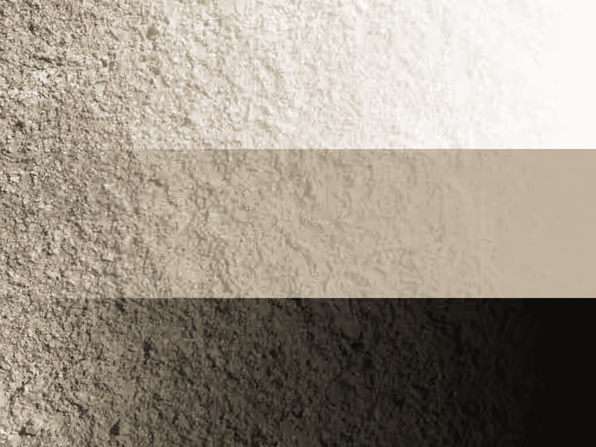
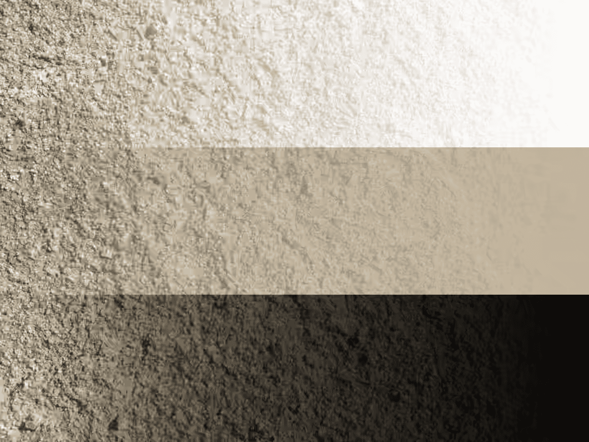
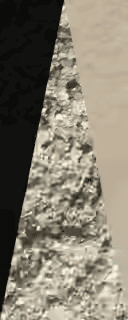
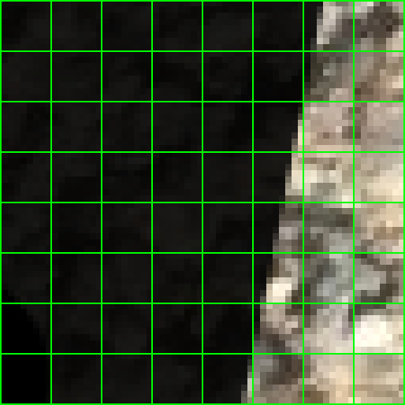
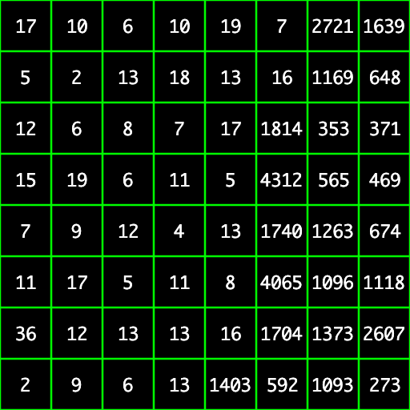

[Top level](../README.md)

# Variance boost

## Overview

Variance boost is a Variance-based Adaptive Quantization (VAQ) implementation for SVT-AV1 that addresses inadequate quantization in low-contrast areas. This is accomplished by "boosting" the quality (decreasing qindex) of superblocks (64x64 pixel regions) that are lower variance, which helps increase the consistency of:

- **Low-contrast areas**: clouds, skin, and delicate textures
- **Low-contrast scenes**: night, foggy, and overexposed shots

## High-level idea

The human eye is able to look approximately as deeply into low-contrast areas as it does into high-contrast areas. A fixed-quantization encoding strategy tends to introduce noticeable artifacts into low-contrast areas like blurring, loss of high frequency detail, transform-basis patterns, or in the most extreme case, collapsing entire superblocks into a single color.

All of the aforementioned artifacts are shown by the example below, which shows two filesize-matched encodes of a rock that progressively fades out to three solid colors (white, beige, and black):

| Without variance boost (QP 50)           | With variance boost (QP 53)       |
|------------------------------------------|-----------------------------------|
|      |   |
| 22,848 bytes                             | 22,352 bytes                      |

Notice how uneven quality is without variance boost. The left (high-contrast) side retains detail with minimal artifacting, but as the image moves across the right (low-contrast) side, visual quality progressively worsens until there are no recognizable features left, distorting the underlying rock texture into low-frequency basis patterns and solid blocks on the right side.

However, the image encoded with variance boost is significantly better balanced. Rock features remain consistent throughout the image, independent of contrast. Variance boost allows for a smarter allocation of bits. Image size is a bit smaller too (97.8% of the fixed QP image).

**Note:** images were transcoded to lossy (dithered) png from their original AVIFs, for markdown viewer compatibility and file size reasons. This process doesn't compromise on showing the positive effects of variance boost.

## Parameters

### `--enable-variance-boost [0-1]` 

Enables variance boost, the feature described in this appendix.

### `--variance-boost-strength [1-4]`

Controls how much low-contrast superblocks are boosted. Higher strengths allow for proportionally greater bit allocation into preserving low-contrast areas. Choosing too high of a strength can cause unnecessary bitrate inflation and inconsistent film grain preservation.

Default is 2.

- **Strength 1** tends to be best for simple untextured or smooth animation
- **Strength 2** is a highly-compatible curve, great for most live-action content and animation with detailed, fine textures
- **Strength 3** is best for still images, or videos with a balanced mix of very high-contrast and low-contrast scenes (e.g. horror or suspense movies)
- **Strength 4** is very aggressive, and only useful under very specific circumstances where low-contrast detail retention must be prioritized

#### Example of varying the strength at QP 55

|    Strength 1    |    Strength 2    |
| ---------------- | ---------------- |
|  | |
| 14,767 bytes     | 16,403 bytes     |

|    Strength 3    |    Strength 4    |
| ---------------- | ---------------- |
  | |
16,826 bytes     | 21,351 bytes     |

### `--variance-octile [1-8]`

Controls how many superblocks are boosted, based on how their internal low-contrast/high-contrast ratio. A value of 1 means only 1/8 of low-contrast area is required to boost the superblock, whereas a value of 8 requires the *entirety* of the superblock has to be low contrast for it to get boosted.

Lower octile values are less efficient (more higher-contrast areas are boosted alongside low-contrast areas, which inflates bitrate), while higher values are less visually consistent (less lower-contrast areas are boosted, which can create low-quality area "holes" within superblocks).

Default is 6. Recommended values are between 4-7.

#### Example of varying the octile at QP 50

|    Octile 1    |    Octile 2    |    Octile 4    |    Octile 6    |    Octile 8    |
| -------------- | -------------- | -------------- | -------------- | -------------- |
|  | |  | | |
| 4,810 bytes    | 4,186 bytes    | 2,507 bytes    | 1,878 bytes    | 1,584 bytes    |

## Description of the algorithm

|Image|Description|
|-|-|
|  | First, variance boost (`svt_variance_adjust_qp()`) loops over all 64x64 superblocks, first horizontally then vertically. |
|  | Then, the algorithm splits each superblock into 8x8 subblocks and calculates the variance of each one of them, getting back 64 values in total. |
|    | Each of the subblock variances correlate to how much contrast there is for that area. The lower the value, the less contrast. Any value below 256 is considered "low variance", and this superblock has more than half of low variance subblocks.  |
 | Then, in `av1_get_deltaq_sb_variance_boost()`, these values are then ordered from lowest to highest variance, and then one of the values is picked at the specified octile, in this case octile 4 (the value at the end of the 4th row highlighted in magenta). |
   | This value is input into one of the four boost formulas, which then outputs a delta-q offset. The higher the curve, the bigger the offset and resulting adjustment. Qindex boosts can go from 0 (for high variance areas) to 80 (for very low variance areas). |
     | Finally, the offset is then applied to the superblock's qindex, and does the same thing to the remaining superblocks. Once done, other parts of the encoding process can run. |

## References

\[1\] https://en.wikipedia.org/wiki/Variance_Adaptive_Quantization  
\[2\] https://people.xiph.org/~xiphmont/demo/theora/demo9.html  
\[3\] https://x264-devel.videolan.narkive.com/eFxZMbt1/variance-based-adaptive-quantization  
\[4\] https://gitlab.com/AOMediaCodec/SVT-AV1/-/issues/2105

## Notes

The feature settings that are described in this document were compiled at
v2.0.0 of the code and may not reflect the current status of the code. The
description in this document represents an example showing how features would
interact with the SVT architecture. For the most up-to-date settings, it's
recommended to review the section of the code implementing this feature.